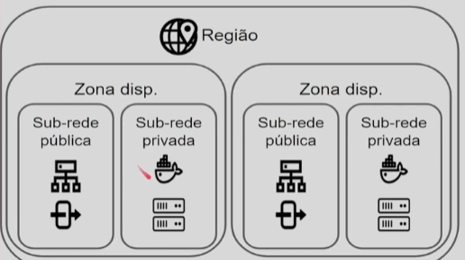
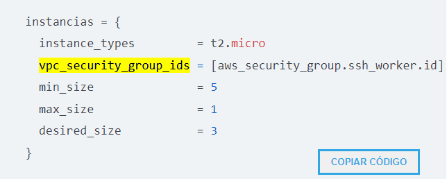
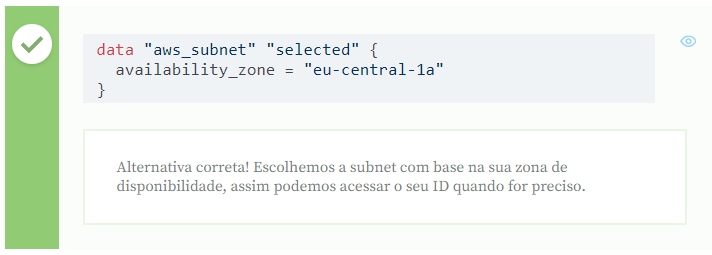
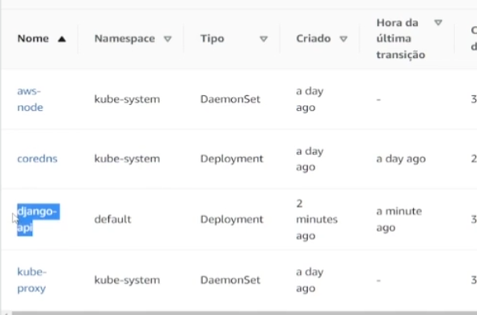

# infraestrutura-codigo-terraform-kubernetes
Curso Alura: Infraestrutura como código: Terraform e Kubernetes
https://cursos.alura.com.br/course/infraestrutura-codigo-terraform-kubernetes

### 1. Iniciando o projeto:
1. Apresentação:
   * Elastic Kubernetes Service: Serviço do kubernetes da AWS.
   * Como o serviço é padronizado, podermos utilizar o mesmo na Amazon, Google ou na Azure ou seja, multi-provedores.
   * Trabalharemos com módulos (como se fossem as bibliotecas), desenvolveremos mais e mais rápido, escrevendo menos código.
   * Kubernetes (cuidará da aplicação) + Terraform (montará o cluster e configurará o Kubernetes).
   * Faremos isso na AWS.
   * Fazendo o curso aprenderemos a colocar Aplicações Docker dentro do Kubernetes, trabalharemos com módulos, Load Balancer e faremos deploy dentro do cluster do Kubernetes.
2. Preparando o ambiente:
   * Baixar o Terraform: https://developer.hashicorp.com/terraform/downloads?product_intent=terraform
     * Extrair em uma pasta: C:\Program Files\Terraform
     * Configurar a variável de ambiente e apontar pra essa pasta.
     * Rodar o comando no terminal: terraform -v.
   * AWS CLI: https://docs.aws.amazon.com/pt_br/cli/latest/userguide/getting-started-install.html
     * Rodar o comando no terminal: aws configure.
     * Criar uma secret key nas Credenciais do AWS IAM: https://console.aws.amazon.com/iam/home?#/security_credentials
3. Projeto do curso anterior:
   * https://github.com/alura-cursos/iac-curso5/tree/Aula_6
4. Entendendo o projeto:
   * Migração de projeto que estava no ECS (Elastic Container Service) para o EKS (Elastik Kubernetes Service).
   * GKE (Google) e AKS (Azure).
   * Vantagens do Kubernetes:
     * Simplicidade na mgiração entre provedores.
     * Maior resitência a falhas. Pq podemos ter instância em diversos lugares diferentes trabalhando como um só.
     * Fácil organização do serviço com pods. Pods podem ser agrupadores de containers.
     * Interligação entre provedores (Kluster na Amazon e outra no Google se comunicando).
   * Dentro do nosso projeto temos a Região: 
     * Dentro desse temos zonas disponíveis: 
       * Dentro de zonas disponiveis temos as Sub-redes publicas e provadas.
       * Dentro da Publica temos nosso Load Balancer e o net gateway pra termos acessos às instancias das redes privadas.
       * Dentro da Rede Privada, temos o ECS e as máquinas que estão rodando as instancias do ECS.
       
     * Além de migrar do ECS para o EKS, também tiraremos o Load-balancer e passaremos para dentro do serviço do Kubernetes.
5. ECS vs EKS:
   * Quais as vantagens do Kubernetes em relação ao ECS?
     * Código aberto: O Kubernetes é uma ferramenta de código aberto, logo qualquer pessoa pode analisá-lo e contribuir com mudanças e melhorias para a ferramenta. https://www.alura.com.br/artigos/open-source-uma-breve-introducao
     * Não é uma tecnologia proprietária: Como não é propriedade de nenhuma Empresa especifica, todos os provedores podem implementá-lo sem precisar de uma licença ou autorização, facilitando a portabilidade e migração do código, diferentemente do ECS que é da AWS.
6. Para saber mais: diferenças do ECS e do EKS:
   * O ECS é uma solução desenvolvida pela AWS para ser simples de configurar e acelerar o processo de lançar aplicações Docker na nuvem. Além disso, se integra facilmente a outros serviços como os Application Load Balancer (ALB) e os autoscaling groups. 
   * O EKS por sua vez é uma ferramenta open source (código aberto), que nos fornece maior flexibilidade, com APIs e uma grande comunidade de pessoas que desenvolvem, o que torna erros mais fáceis de serem corrigidos. 
   * Em termos de custos, ambos ECS e EKS são pagos, porém o ECS cobra apenas o preço das máquinas criadas. Já o EKS cobra pelas máquinas e pelo cluster. Para aplicações pequenas ou poucas aplicações, o ECS acaba saindo um pouco mais barato, mas se precisarmos de mais máquinas, o EKS leva a vantagem pelo fato do Kubernetes ter uma melhor escalabilidade, o que reduz os seus custos. 
   * Outro ponto importante é a questão do ECS usar tecnologias proprietárias, o que impossibilita portar sua infraestrutura de forma rápida para outro provedor. No EKS isso não ocorre por ser uma tecnologia aberta e implementada por vários provedores.
7. Iniciando o projeto:
   * terraform init
   * terraform destroy
   * Mas nem sempre poderemos fazer isso, pois nossos clientes precisam da aplicação up e não podemos derruba-la. Nesse caso teríamos que subir uma infra completa separada e depois fazer uma migração para termos o minimo possivel de downtime.
   * Removidos arquivos do ECS.tf, ALB.tf (Load Balancer), IAM.tf. Podemos usar o terraform aply pra manter o projeto local o mais parecido com o que ta em cloud (essa parte não foi explicada mto bem).
   * Remover o código que não será mais utilizado, sempre executando o comando terraform destroy antes ou o terraform apply após a modificação.
### 2. Módulo do EKS:
2. Alterando o G.S:
   * Grupo de Segurança.
   * Pra usarmos o Kubernetes, precisaremos montar um cluster.
   * Um cluster é um conjunto de máquinas em que nossas instâncias do Kubernetes vai ficar.
     * Nodes/nós são as máquinas que estamos executando em nosso cluster.
   * Realizamos alterações dentro de GrupoSecuranca.tf.
3. Faça como eu fiz: configurações do grupo de segurança:
   * SSH/22, HTTP/80, HTTPS/443, FTP/20-21 são protocolos e portas mais comuns para acessarmos as máquinas via SSH, fazermos requisições via HTTP e HTTPS ou acessar arquivos via FTP.
4. Módulo do EKS:
   * Acessar Registry dentro do Terraform e pesquisar por EKS: https://registry.terraform.io/?product_intent=terraform
   * https://registry.terraform.io/modules/terraform-aws-modules/eks/aws/latest
   * Pegamos o Usage e criamos o EKS.tf.
   * Retiramos o Self Managed e deixamos o EKS Managed Node para que o EKS monte nossas configurações.
5. Para saber mais: exemplos muito grandes:
   * Quando copiamos o exemplo do Modulo do Terraform, vieram diversos códigos que não utilizamos.
   * É importante entendermos os mesmos para podermos limpar códigos desnecessários.
6. Configurando o EKS:
   * Realizadas mais configurações dentro do EKS.tf.
   * Retirado códigos que não utilizaremos.
7. Exemplo do EKS:
   * Selecionar os campos com possíveis erros:
   * 
     * instance_types, pois o tipo de máquina deveria estar em formato de texto e os campos deveriam estar entre colchetes, pois podemos utilizar mais de uma opçção.
     * min_size e max_size, pois o min está maior que o max, o que pode causar erros e inconsistências.
### 3. Configurando outro provedor:
2. Subindo o Cluster:
   * O ideal é subir por etapas pra evitar efeitos/problemas em cascatas.
   * Acessar o env/prod e rodar o "terraform init".
   * Isso vai realizar as configurações iniciais, baixar modulos necessários, configurar o backend no s3 e tudo que é necessário pra montar a infra no cloud.
   * Deu erro.
   * Realizamos a criação da chave na AWS e utilizamos o comando aws configure.
   * Criei o bucket terraform-gabriel-example do Backend pois o init informava que era necessário criar primeiro.
   * Alterei as regiões para us-east.
   * Rodei o "terraform init -reconfigure" e deu certo.
   * Retirada algumas configurações do Main. Retirada as variaveis de Variaveis.tf tbm. Tive que recriar a GrupoSeguranca igual está no github do alura.
   * Para executar, digitar terraform apply e confirmar.
   * Acessar o EKS no AWS e verificar se o cluster producao foi criado.
     * Dentro teremos 3 nodes/nós prontas para serem utilizadas.
4. Dois provedores:
   * Trabalhar com dois provedores de recursos no Terraform, a AWS, que provê a infraestrutura e o Kubernetes, que a configura para a aplicação.
   * Para nos comunicar com o cluster que criamos, precisaremos do cluster_endpoint_private_access.
   * Pra isso precisaremos utilizar um outro provedor do Kubernetes.
   * Examples: https://registry.terraform.io/providers/hashicorp/kubernetes/latest/docs
   * https://github.com/hashicorp/terraform-provider-kubernetes/blob/main/_examples/eks/README.md
   * Inserida configuração dentro do Provider do exemplo pego acima no main.tf.
5. Para saber mais: trabalhando com múltiplos provedores:
   * Para o Terraform, um provedor é uma maneira de se comunicar com alguma ferramenta externa, podendo ser a AWS, o Google, o Kubernetes ou uma API que aceite requisições HTTP.
6. Data sources:
   * Dentro do Provider, temos os data, é disso que estamos falando.
   * Usar os Data Sources, que funcionam como fonte de dados da nossa infraestrutura, para recursos já existentes ou que acabamos de criar.
   * Fonte de Dados que podemos utilizar pra obter informações de nossos recursos.
   * Conseguimos pegar os dados do cluster, como nome, id, arn (amazon resource name), qnd foi criado, etc.
7. Obtendo dados:
   * Ana está tentando obter o ID de uma subnet que criou em eu-central-1a usando os data sources. Para isso, ela desenvolveu alguns códigos possíveis e precisa de ajuda para descobrir qual deles está correto. Também trouxe a documentação do data source da aws_subnet para consultar, caso necessário.
   * 
### 4. Preparando a aplicação:
2. Substituindo o YAML:
   * Quando preparamos aplicações pra serem executadas no Kubernetes, existem duas formas:
     * Imperativa: Através de comandos executados em sequências.
     * Declarativa: Através de arquivos .json ou .yaml.
   * No Terraform só trabalhamos em forma declarativa.
   * Precisamos por nossa aplicação dentro do pod no Kubernetes.
   * Pesquisaremos dentro do site do terraform > registry > kubernetes > documentation: https://registry.terraform.io/providers/hashicorp/kubernetes/latest/docs/resources/deployment
   * Criado arquivo Kubernetes.tf e nele que são feitas as configurações da aplicação que será feito deploy.
   * Como não subi nenhuma imagem, estou usando uma do repositório do docker.
3. Outra aplicação:
   * Análise de código incorretos:
     ```sh
      match_labels = {
        test = "nginx:1.7.8"
      }
     e
     repository = "nginx:1.7.8"
     ```
   * Estão errados pois o match_labels deve ter uma label que já foi criada em alguma outra parte do código.
   * E o campo que devemos colocar o container a ser utilizado á o image. O campo repository não pode ser usado dentro do container.
4. Verificação de saúde:
   * liveness_probe nos ajuda a ver qual o estado atual da nossa aplicação, se está travada ou respondendo às requisições normalmente.
   * É como se fosse um health check que usamos no Bitbucket/GCP.
   * Nele podemos configurar o path do endpoint e de quanto em quanto tempo ele vai ser verificado, além da verificação inicial.
   * É importante verificar se a nossa aplicação é demorada pra subir ou mto pesada, pra não ficar fazendo muitas requisições.
   * O tempo ideal é entre 3 a 15 segundos, pois caso a aplicação caia, não demore muito pra matarmos um pod e subir novamente.
5. Para saber mais: Liveness Probe:
   * Kubernetes tem várias maneiras de verificar se um container está sendo executado, sendo a principal o uso de sondas ou probres.
   * Essas sondas podem realizar a validação através de 3 formas:
     * Comando com retorno 0.
     * Requisição HTTP com retorno entre 200 e 400.
     * Conexão TCP, verificando se a porta desejada está aberta.
   * De preferência utilizaremos a forma que o cliente irá utilizar. 
     * Ou seja, se for uma API, usar opção HTTP.
     * Se for algo relacionado a abnco, algum comando que intereja com o banco.
     * Ou se for proxy, a TCP.
   * Mais info: https://kubernetes.io/docs/concepts/workloads/pods/pod-lifecycle/#container-probes
6. Testando o Kubernetes:
   * Abrir env/prod e rodar o "terraform init" pra initilizar o terraform.
   * cmd "terraform apply" pra comparar o que temos atualmente e o que queremos criar pra ver as diferenças.
   * Digitar 1 pra yes.
   * Entrar no AWS e verificar o EKS.
   * Visão geral aparecem as 3 máquinas que estão sendo executadas.
   * Em cargas de trabalho temos a aplicação em execução:
   
   * Se o namespace estiver com kube-system, significa que foi o Kubernetes que criou. Default foi feito de forma externa.